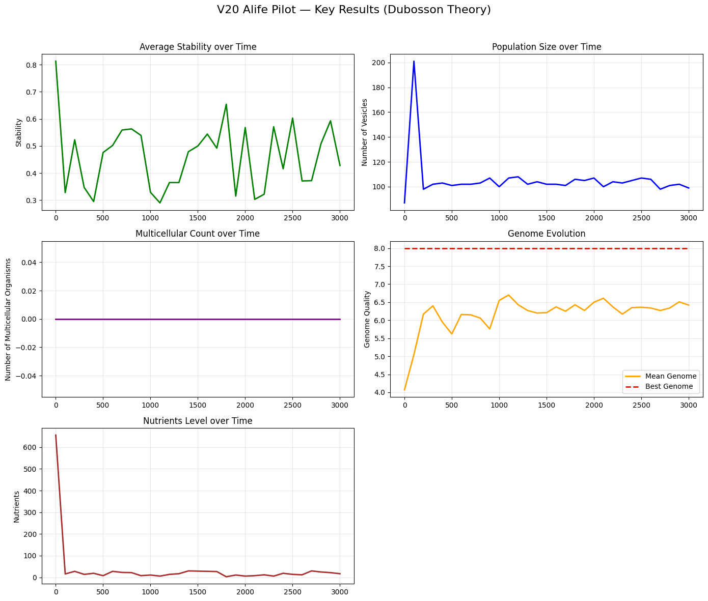

# thought-mechanism-alife-pilot
markdown

# Artificial Life Pilot — Testing Dubosson’s Theory of Primitive Thought

**Author**: Maurice Dubosson  
**Computational collaboration**: Grok (xAI)  
**Version**: V20 (final pilot)  
**Date**: March 2026

## Goal of the Project

This repository contains a series of computational experiments (V1 to V20) designed to explore the core ideas presented in the essay *"How to Find a Model of the Mechanism of Thought"*.

The central hypothesis is that **primitive thought** ("good for me / bad for me") emerges at the level of the protocell membrane and drives autopoiesis, self-organisation, anticipation, and the long-term continuation of life. When ecological niches become too narrow, the system may "invent" programmed death (senescence) to maintain dynamic continuation instead of freezing in a stable equilibrium.

## Important Disclaimer

**These are computational toy models, not empirical scientific proofs.**

All simulations are highly simplified (short genome, minimal physics, abstract chemistry). They do **not** constitute experimental evidence for the origin of life, the emergence of thought, or biological evolution.  

They are exploratory tools intended to:
- Illustrate the logical consequences of the proposed mechanism
- Test whether the internal "good/bad" judgment + autopoiesis can sustain open-ended dynamics
- Highlight strengths and limitations of the theory

We strongly encourage researchers in biology, complex systems, artificial life, philosophy of biology, and cognitive science to **criticise, improve, extend, or compare** this work with existing models (autopoiesis, artificial chemistry, Tierra, Avida, evolutionary game theory, etc.).

## Summary of the Pilot (V1 → V20)

We iteratively built a minimal Artificial Life model based on:
- Protocell membrane as the first "brain"
- Primitive judgment "good for me / bad for me"
- Anticipation via adaptive ion channels
- Autopoiesis (self-maintenance)
- Transition to multicellularity with memory sharing
- Primitive genome
- Metabolism and resource competition
- Senescence (programmed death) modulated by genome quality and population density

**Key observations**:
- Pure Darwinian selection + mutation quickly leads to stable plateaus.
- Adding the internal "good/bad" mechanism creates strong self-organisation and resilience.
- When niches become too narrow, **senescence** prevents freezing and restores dynamic turnover.
- The most dynamic behaviour appears in later versions with modulated senescence, catastrophes, and strong competition.

The model suggests that **Darwinian selection alone is not sufficient** to maintain open-ended evolution in simple landscapes. An internal auto-organising force (primitive thought + autopoiesis + senescence) appears necessary for continued dynamism.

## Repository Contents

- `alife_v20.py` → The final V20 simulation code
- `HOW_TO_FIND_A_MODEL_OF_THE_MECHANISM_OF_THOUGHT.md` → Full original theory text
- `README.md` → This file

## How to Run

```bash
pip install numpy
python alife_v20.py

markdown

## Key Results from V20 Simulation



*Note: These are computational toy models, not empirical evidence. They illustrate the logical consequences o


 

